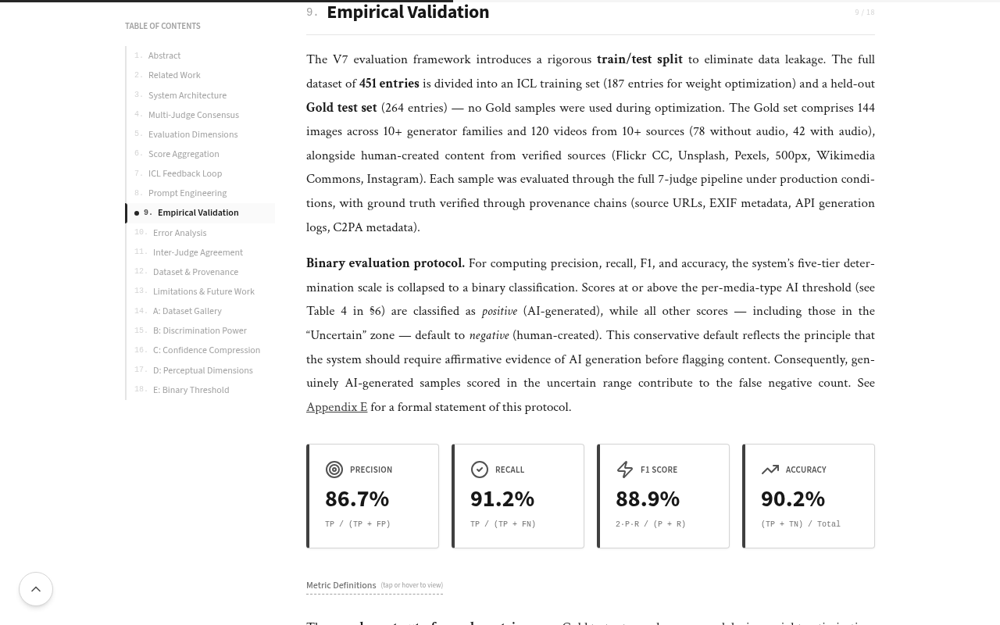
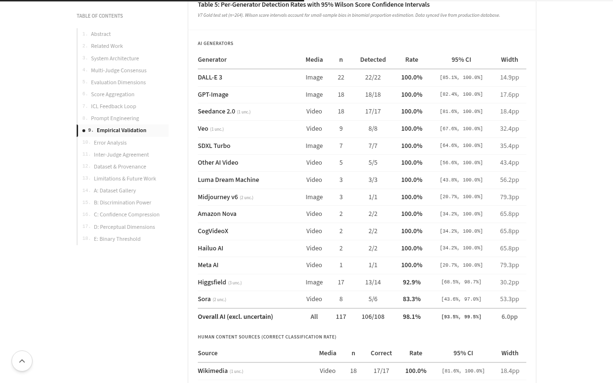

# AI Detect

**Multi-Judge LLM System for AI-Generated Content Detection**

*An ensemble of 7 independent LLM judges evaluating media across 6 perceptual dimensions with per-media-type optimization and ICL-driven continuous improvement.*

**Author: [Joon Lim](https://www.linkedin.com/in/joonlim/)**

---

## What is this?

AI Detect is a detection system I built to evaluate whether visual media — images and videos — is AI-generated or human-created. Instead of relying on a single classifier, it runs **7 independent large language model judges** from 6 providers in parallel, then aggregates their assessments through confidence-weighted scoring with variance-penalized consensus.

The key design choices:

- **In-Context Learning (ICL)** instead of fine-tuning — prompts are iteratively refined without retraining, preserving model agnosticism and enabling instant iteration.
- **Per-media-type optimization** — separate weight profiles and classification thresholds for images, video-without-audio, and video-with-audio, determined through grid search across 4,946 configurations with leave-one-out cross-validation.
- **6 perceptual dimensions** (4 visual + 2 audio) — each judge evaluates media across structured criteria rather than giving a single binary verdict. Dimensions are conditionally activated based on media type.

The full methodology, validation results, and technical details are published as an [interactive research paper](https://www.aidetect.art/methodology) with PDF export.

### By the Numbers

| Metric | Value |
|--------|-------|
| Lines of TypeScript | 55,300+ |
| Pages / Screens | 20 |
| Reusable UI components | 18 |
| tRPC API endpoints | 101 (29 queries, 6 mutations, 66 admin) |
| Database tables | 27 |
| Database helper functions | 30 |
| Test cases | 533 across 38 test files |
| Gold validation samples | 264 (144 images, 120 videos) |
| LLM judges in ensemble | 7 |
| Perceptual dimensions | 6 (4 visual, 2 audio) |

---

## Screenshots

### Evaluation Interface

  

### Validation Results (Live from Production DB)

  

### Per-Generator Detection Rates (Dynamic Table 5)

  

### Interactive Research Paper

---

## How It Works

### The Judge Panel

Seven state-of-the-art multimodal models independently evaluate each piece of media. Each judge scores the content across up to 6 perceptual dimensions, then a weighted aggregation produces the final determination.

| Judge | Provider | Role |
|-------|----------|------|
| GPT-4o | OpenAI | Strong reasoning, broad visual knowledge |
| Gemini 2.0 Flash | Google DeepMind | Fast multimodal understanding |
| Claude 3.5 Sonnet | Anthropic | Detailed analysis, well-calibrated confidence |
| Pixtral Large | Mistral AI | Technical visual analysis |
| Llama 4 Scout | Meta AI | Open-source alternative perspective |
| Grok 2 Vision | xAI | Fast, high-quality analysis |
| Amazon Nova Premier | Amazon | Additional perspective with strong visual grounding |

If a judge fails or times out, the system gracefully degrades and computes results from the remaining judges. A hybrid LLM routing layer tries direct provider APIs first, then falls back to OpenRouter.

### 6 Evaluation Dimensions

The system evaluates media across 6 perceptual dimensions — 4 visual and 2 audio — with **per-media-type weight profiles** optimized through empirical grid search. Dimensions are conditionally activated based on media type: images activate 4 visual dimensions, silent videos add Temporal Coherence, and videos with audio activate all 6.

| Dimension | Image | Video (no audio) | Video (with audio) |
|-----------|:-----:|:-----------------:|:-------------------:|
| Visual Artifacts & Anomalies | 5% | 5% | 5% |
| Physical Consistency | 5% | 5% | 5% |
