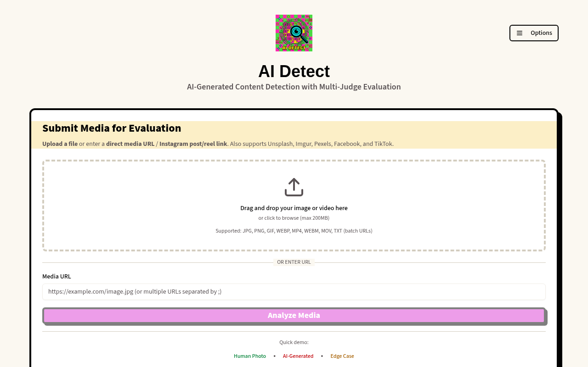
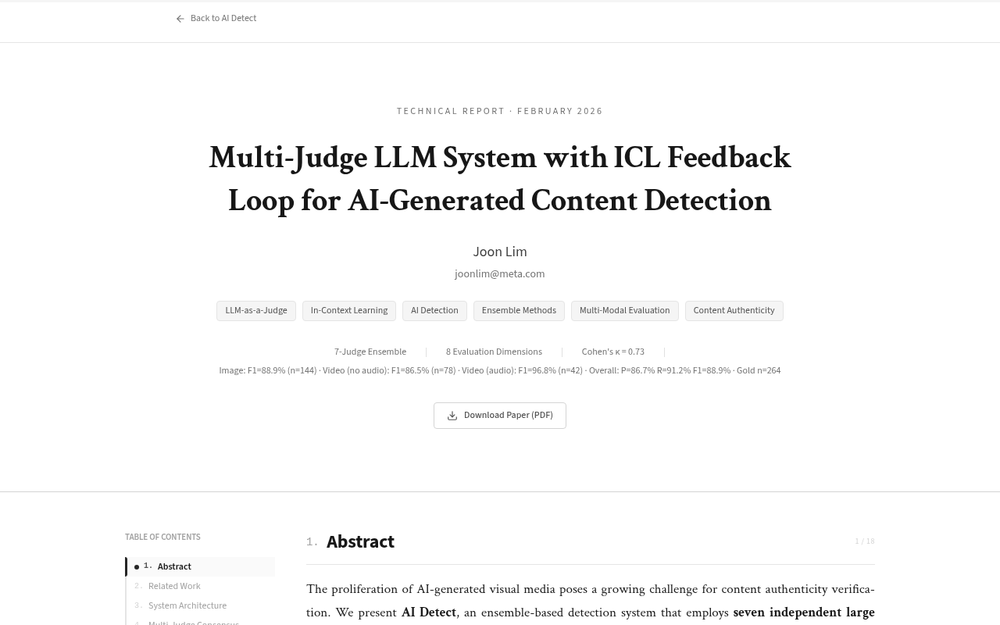

<div align="center">

# AI Detect

**Multi-Judge LLM System for AI-Generated Content Detection**

[](https://www.aidetect.art)
[](https://www.aidetect.art/methodology)
[](#validation-results)
[](#validation-results)

*An ensemble of 7 independent LLM judges evaluating media across 6 perceptual dimensions with per-media-type optimization and ICL-driven continuous improvement.*

**Author: [Joon Lim](https://www.linkedin.com/in/joonlim/)**

</div>

---

## What is this?

AI Detect is a detection system I built to evaluate whether visual media — images and videos — is AI-generated or human-created. Instead of relying on a single classifier, it runs **7 independent large language model judges** from 6 providers in parallel, then aggregates their assessments through confidence-weighted scoring with variance-penalized consensus.

The key design choices:

- **In-Context Learning (ICL)** instead of fine-tuning — prompts are iteratively refined without retraining, preserving model agnosticism and enabling instant iteration.
- **Per-media-type optimization** — separate weight profiles and classification thresholds for images, video-without-audio, and video-with-audio, determined through grid search across 4,946 configurations with leave-one-out cross-validation.
- **6 perceptual dimensions** (4 visual + 2 audio) — each judge evaluates media across structured criteria rather than giving a single binary verdict. Dimensions are conditionally activated based on media type.

The full methodology, validation results, and technical details are published as an [interactive research paper](https://www.aidetect.art/methodology) with PDF export.

### By the Numbers

| Metric | Value |
|--------|-------|
| Lines of TypeScript | 55,300+ |
| Pages / Screens | 20 |
| Reusable UI components | 18 |
| tRPC API endpoints | 101 (29 queries, 6 mutations, 66 admin) |
| Database tables | 27 |
| Database helper functions | 30 |
| Test cases | 533 across 38 test files |
| Gold validation samples | 264 (144 images, 120 videos) |
| LLM judges in ensemble | 7 |
| Perceptual dimensions | 6 (4 visual, 2 audio) |

---

## Screenshots

<div align="center">

### Evaluation Interface


<br/><br/>

### Interactive Research Paper


</div>

---

## How It Works

### The Judge Panel

Seven state-of-the-art multimodal models independently evaluate each piece of media. Each judge scores the content across up to 6 perceptual dimensions, then a weighted aggregation produces the final determination.

| Judge | Provider | Role |
|-------|----------|------|
| GPT-4o | OpenAI | Strong reasoning, broad visual knowledge |
| Gemini 2.0 Flash | Google DeepMind | Fast multimodal understanding |
| Claude 3.5 Sonnet | Anthropic | Detailed analysis, well-calibrated confidence |
| Pixtral Large | Mistral AI | Technical visual analysis |
| Llama 4 Scout | Meta AI | Open-source alternative perspective |
| Grok 2 Vision | xAI | Fast, high-quality analysis |
| Amazon Nova Premier | Amazon | Additional perspective with strong visual grounding |

If a judge fails or times out, the system gracefully degrades and computes results from the remaining judges. A hybrid LLM routing layer tries direct provider APIs first, then falls back to OpenRouter.

### 6 Evaluation Dimensions

The system evaluates media across 6 perceptual dimensions — 4 visual and 2 audio — with **per-media-type weight profiles** optimized through empirical grid search. Dimensions are conditionally activated based on media type: images activate 4 visual dimensions, silent videos add Temporal Coherence, and videos with audio activate all 6.

| Dimension | Image | Video (no audio) | Video (with audio) |
|-----------|:-----:|:-----------------:|:-------------------:|
| Visual Artifacts & Anomalies | 5% | 5% | 5% |
| Physical Consistency | 5% | 5% | 5% |
| Temporal Coherence | — | 5% | 5% |
| Semantic & Contextual Analysis | 90% | 85% | 20% |
| Audio Naturalness & Artifacts | — | — | 50% |
| Audio-Visual Coherence | — | — | 15% |

> **Key finding:** Audio dimensions carry **65% of total weight** for video-with-audio content. Audio Naturalness is the single strongest discriminator, achieving the highest AUC of any dimension. Semantic & Contextual Analysis dominates for images and silent video.

Each dimension is supported by detection rationale grounded in peer-reviewed research. See the [full methodology](https://www.aidetect.art/methodology#appendix-dimensions) for detailed literature citations.

### Per-Media-Type Classification

Rather than applying a single threshold, the system uses distinct classification boundaries for each media type:

| Media Type | Human | Likely Human | Uncertain | Likely AI | AI |
|------------|:-----:|:------------:|:---------:|:---------:|:--:|
| Image | ≤ 10 | ≤ 20 | 21–48 | 49–58 | ≥ 59 |
| Video (no audio) | ≤ 10 | ≤ 20 | 21–40 | 41–50 | ≥ 51 |
| Video (with audio) | ≤ 10 | ≤ 22 | 23–42 | 43–52 | ≥ 53 |

---

## Architecture

```
┌──────────────────────────────────────────────────────────────────────┐
│                         Frontend Client                              │
│  React 19 · Tailwind CSS 4 · shadcn/ui · TanStack Query             │
│  ┌─────────────┐  ┌──────────────┐  ┌──────────────────────────────┐│
│  │  20 Pages   │  │ 18 Components│  │ Real-time Streaming Reports  ││
│  └──────┬──────┘  └──────┬───────┘  └──────────────┬───────────────┘│
│         └────────────────┼──────────────────────────┘                │
│                          │ tRPC Client (type-safe)                   │
├──────────────────────────┼───────────────────────────────────────────┤
│                     API Server                                       │
│  Express 4 · tRPC 11 · Rate Limiter · Abuse Monitor                 │
│  ┌───────────────────┐  ┌──────────────┐  ┌────────────────────────┐│
│  │ 101 tRPC Endpoints│  │ Media Pipeline│  │ PDF Paper Generator   ││
│  │ (queries/mutations)│  │ (FFmpeg, S3) │  │ (Dynamic from DB)     ││
│  └─────────┬─────────┘  └──────┬───────┘  └────────────────────────┘│
│            └───────────────────┼──────────────────────────           │
│                                │                                     │
├────────────────────────────────┼─────────────────────────────────────┤
│                    LLM Orchestration Layer                           │
│  ┌─────────┐ ┌─────────┐ ┌────────┐ ┌───────┐ ┌───────┐ ┌───────┐ │
│  │ GPT-4o  │ │ Claude  │ │ Gemini │ │ Llama │ │Mistral│ │ Grok  │ │
│  │         │ │ 3.5 Son.│ │ 2.0 Fl.│ │4 Scout│ │Pixtral│ │2 Vis. │ │
│  └────┬────┘ └────┬────┘ └───┬────┘ └───┬───┘ └───┬───┘ └───┬───┘ │
│       └───────────┴──────────┴───────────┴─────────┴─────────┘     │
│                          │ Ensemble Fusion                           │
│  ┌──────────────────────────────────────────────────────────────┐   │
│  │  Weighted Score Aggregation · Wilson CI · ICL Feedback Loop  │   │
│  │  6 Perceptual Dimensions · Confidence Compression            │   │
│  └──────────────────────────────────────────────────────────────┘   │
│                                                                      │
├──────────────────────────────────────────────────────────────────────┤
│                        Data Layer                                    │
│  ┌──────────────┐  ┌──────────┐  ┌──────────┐  ┌─────────────────┐ │
│  │  MySQL/TiDB  │  │ S3 File  │  │ OpenRouter│  │ Social Media    │ │
│  │  Drizzle ORM │  │ Storage  │  │ LLM APIs │  │ Extractors      │ │
│  │  27 Tables   │  │          │  │          │  │ (IG, TikTok...) │ │
│  └──────────────┘  └──────────┘  └──────────┘  └─────────────────┘ │
└──────────────────────────────────────────────────────────────────────┘
```

### Tech Stack

| Layer | Technology | Purpose |
|-------|-----------|---------|
| **Frontend** | React 19, Tailwind CSS 4, shadcn/ui | Responsive UI with real-time streaming evaluation reports |
| **State** | TanStack Query, tRPC hooks | Type-safe server state with optimistic updates |
| **API** | tRPC 11, Express 4, Zod | End-to-end type-safe RPC with runtime validation |
| **LLM** | OpenRouter + direct APIs (7 models) | Multi-provider LLM orchestration with fallback |
| **Database** | MySQL/TiDB, Drizzle ORM | 27-table schema for evaluations, gold data, and analytics |
| **Storage** | S3 (Cloudflare R2) | Media file storage with CDN delivery |
| **Media** | FFmpeg, sharp | Video frame extraction, audio analysis, image processing |
| **Auth** | OAuth, JWT | Session-based authentication with role-based access |
| **PDF** | Custom TS generator | Dynamic research paper generation from live DB |
| **Testing** | Vitest | 533 tests across 38 suites |

---

## Key Features

### Multi-Judge Ensemble Evaluation
Seven frontier LLMs independently evaluate each submission across six perceptual dimensions (Visual Artifacts, Physical Consistency, Temporal Coherence, Semantic Plausibility, Audio Naturalness, Audio-Visual Coherence). Dimensions are conditionally activated based on media type.

### ICL Feedback Loop
An In-Context Learning feedback loop supplies each judge with curated few-shot examples from a training set of 187 labeled samples. Examples are selected based on media type and include both correctly classified and edge-case samples to calibrate judge behavior.

### Statistical Aggregation Pipeline
Individual judge scores are fused through a weighted aggregation system with per-judge reliability weights derived from Gold set performance. The system applies Wilson score confidence intervals for small-sample proportion estimation and a confidence compression function that maps raw scores to calibrated confidence levels.

### Dynamic Research Paper
The full methodology paper is generated dynamically from the production database — validation metrics, per-generator detection rates, confusion matrices, and inter-judge agreement statistics all reflect the current state of the system. Available as both an [interactive web document](https://www.aidetect.art/methodology) and a [downloadable PDF](https://www.aidetect.art/api/paper.pdf).

### Social Media Integration
Direct analysis of content from Instagram posts/reels, TikTok videos, Facebook, Unsplash, Pexels, and Imgur. The system extracts media from social platform URLs, handles authentication and rate limiting, and processes both images and videos.

### Human Label Collection
A structured labeling interface for collecting human ground-truth labels with trustworthiness weighting. Raters are first assessed against deterministic samples before being shown non-deterministic content, and their labels are weighted by measured precision/recall.

### Admin Dashboard
Real-time monitoring of system health, evaluation queues, cost tracking per LLM model, gold data management, and per-generator performance analytics.

---

## Validation Results

The system was validated on a **Gold test set of 264 samples** (144 images + 120 videos) sourced from 15+ AI generators (DALL-E 3, GPT-Image, Seedance 2.0, Sora, Veo, Midjourney, Higgsfield, SDXL Turbo, CogVideoX, Hailuo AI, Amazon Nova, Meta AI, Luma Dream Machine) and 5 human content sources (Flickr CC, Pexels, Unsplash, Wikimedia, Instagram).

| Metric | Images (n=144) | Video — no audio (n=78) | Video — with audio (n=42) | Combined (n=264) |
|--------|:--------------:|:-----------------------:|:-------------------------:|:-----------------:|
| Precision | 88.0% | 82.1% | 95.5% | 86.7% |
| Recall | 89.8% | 91.4% | 100.0% | 91.2% |
| F1 Score | 88.9% | 86.5% | 97.7% | 88.9% |
| Accuracy | 92.4% | 84.6% | 97.6% | 90.5% |

> **Inter-judge agreement:** Cohen's κ = 0.73 (substantial agreement) across all judge pairs, indicating the judges are independently converging on similar conclusions rather than echoing each other.

### Per-Generator Detection Rates

Detection rates are tracked in real time from the production database. The table below shows rates as of the latest validation run:

| Generator | Media | n | Detected | Rate | 95% Wilson CI |
|-----------|-------|---|----------|------|---------------|
| DALL-E 3 | Image | 22 | 22/22 | 100.0% | [85.1%, 100.0%] |
| GPT-Image | Image | 18 | 18/18 | 100.0% | [82.4%, 100.0%] |
| Seedance 2.0 | Video | 18 | 17/17 | 100.0% | [81.6%, 100.0%] |
| Veo | Video | 9 | 8/8 | 100.0% | [67.6%, 100.0%] |
| SDXL Turbo | Image | 7 | 7/7 | 100.0% | [64.6%, 100.0%] |
| Sora | Video | 8 | 5/6 | 83.3% | [43.6%, 97.0%] |
| Higgsfield | Image | 17 | 13/14 | 92.9% | [68.5%, 98.7%] |

> Live, up-to-date per-generator rates with Wilson CIs are available at [aidetect.art/methodology#table-5](https://www.aidetect.art/methodology#table-5).

### Data Quality

The gold dataset was curated with strict quality controls:

- Evaluations with fewer than 4 responding judges (of 7) were excluded.
- Failed evaluations (confidence = 0) were removed.
- Samples with irrelevant audio (stock music overlays) were flagged and excluded from audio-weighted scoring.
- Ground truth labels were verified through multiple sources: platform metadata, EXIF data, API generation logs, C2PA metadata, and manual expert review.

---

## Database Schema

The database contains **27 tables** organized into logical groups:

| Group | Tables | Purpose |
|-------|--------|---------|
| **Core** | `users`, `evaluations`, `judgeResults`, `dimensionScores` | User accounts and evaluation data |
| **Feedback** | `researcherFeedback`, `crowdsourcedLabels` | Expert and community feedback |
| **Labeling** | `labelers`, `labelerSessions`, `labelerReliability`, `achievements`, `calibrationSamples`, `labelerCalibration`, `calibrationResponses` | Crowdsourced annotation system |
| **Validation** | `groundTruthCases`, `validationDataset`, `validationResults` | Gold dataset and ground truth |
| **Platform** | `apiKeys`, `scheduledJobs`, `jobRuns`, `comparisonSnapshots` | API access and automation |
| **Safety** | `abuseEvents`, `abuseAlertSummaries` | Rate limiting and abuse detection |
| **Caching** | `mediaCache`, `extractionErrors` | Media extraction caching |
| **Analytics** | `llmUsageLogs` | LLM cost and usage tracking |

---

## Routes

| Route | Description | Access |
|-------|-------------|--------|
| `/` | Landing page with evaluation interface and showcase gallery | Public |
| `/methodology` | Full technical research paper (18 sections) with PDF export | Public |
| `/community` | Community research dashboard and leaderboards | Public |
| `/history` | Complete evaluation history with search and filtering | Public |
| `/showcase` | Featured evaluation showcase | Public |
| `/compare` | Side-by-side evaluation comparison | Public |
| `/labeling` | Crowdsourced ground truth labeling interface | Labeler auth |
| `/admin` | System health, abuse detection, evaluation statistics | Admin only |
| `/dataset-review` | Gold dataset review and curation tool | Admin only |

---

## REST API

A public REST API is available at `/api/v1/` for programmatic access with API key authentication.

```bash
# Evaluate media
curl -X POST https://www.aidetect.art/api/v1/evaluate \
  -H "Authorization: Bearer YOUR_API_KEY" \
  -H "Content-Type: application/json" \
  -d '{"mediaUrl": "https://example.com/image.jpg"}'

# Response
{
  "id": 12345,
  "determination": "AI-Generated",
  "overallScore": 72,
  "overallConfidence": 85,
  "consensusLevel": "Strong Consensus",
  "mediaType": "image",
  "judgeResults": [ ... ],
  "dimensionScores": [ ... ]
}
```

---

## Research Paper

The full technical methodology is published as an interactive web document at [aidetect.art/methodology](https://www.aidetect.art/methodology). It covers:

1. Abstract
2. Related Work
3. System Architecture
4. Multi-Judge Consensus
5. Evaluation Dimensions
6. Score Aggregation
7. ICL Feedback Loop
8. Prompt Engineering
9. Empirical Validation
10. Error Analysis
11. Inter-Judge Agreement
12. Dataset & Provenance
13. Limitations & Future Work
14. Appendix A: Dataset Gallery (264 samples with thumbnails)
15. Appendix B: Discrimination Power Analysis
16. Appendix C: Confidence Compression
17. Appendix D: Perceptual Dimension Details (with detection rationale)
18. Appendix E: Binary Classification Threshold Protocol

A downloadable PDF version is available from the [paper page](https://www.aidetect.art/api/paper.pdf).

---

## Author

**Joon Lim** — Data Scientist & Engineer

Previously at Meta, LinkedIn, and Google. Focused on LLM post-training, evaluation systems, and building AI-native products end-to-end.

[](https://www.linkedin.com/in/joonlim/)
[](https://github.com/joonlim-official)

---

## License

This repository contains project documentation and showcase materials only. The source code is maintained in a private repository. For inquiries about collaboration or access, please reach out via [LinkedIn](https://www.linkedin.com/in/joonlim/) or email.

---

<div align="center">

**Research Tool Disclaimer:** This is a research tool for AI content detection. Results should be interpreted by qualified researchers and not used as definitive proof without human expert verification.

[Try the Live Demo](https://www.aidetect.art) · [Read the Paper](https://www.aidetect.art/methodology) · [Download PDF](https://www.aidetect.art/api/paper.pdf)

</div>
